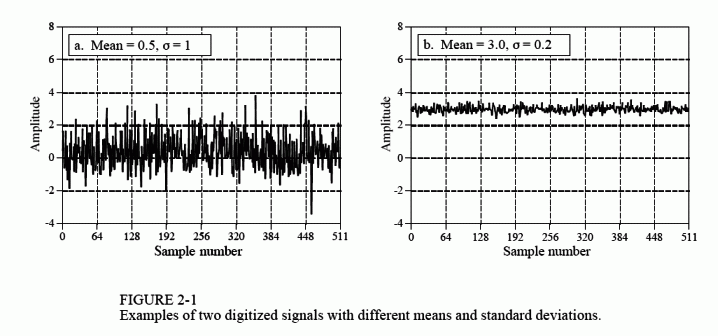

# 信号和图形术语

信号描述了一个变量如何被另一个变量所定义。例如，模拟电子设备中最常见的一种信号是电压随时间变化。由于我们可以假定两个参数的值在一定范围内都是连续的，我们可以称其为连续信号。相比之下，将该信号通入模数转换器，以对两个参数中的每一个参数进行强制量化。例如，想象一下以12bit的精度、1khz的采样频率对其进行转换。电压的值将被缩减为4096个不同的二进制电平，并且时间的增量仅被定义为1ms。以这种方式对参数进行量化而形成的信号，被称为离散信号或数字信号。尽管在计算机中信号都是以离散形式存在，但在大多数情况下，自然界中的信号都是连续的（但您仍然可以在这两种环境下找到例外情况）。也有可能存在一个参数是连续的，而另一个参数是离散的信号。由于这种混合信号比较少见，因此没有给他们指定特殊名称，并且必须明确说明两个参数的性质。

图2-1展示了两个离散信号，这种信号可以由数字数据采集系统所采集。竖轴可以表示电压、光强度、声压或其他各种参数。由于我们并不知道在这种特定情况下它到底代表了什么参数，因此我们将其赋予通用标签：振幅Amplitude。此参数也有其他几个名称：y轴，因变量，值域，纵坐标。

横轴用于表示信号的另一个参数，它也称为：x轴，自变量，定义域，横坐标。采样信号水平轴上的最常见的参数是时间；除此之外，其他参数常用于特定应用场景。例如，地球物理学家可能会沿着地表以灯等距测量的方式获得岩石密度的测量值。为了使内容具有通用性，我们简单地将水平轴标记为：样本编号。如果这是一个连续信号，则必须使用另一个标签，例如：时间，距离，x等。

组成信号的两个参数通常不可互换位置。通常将y轴上的参数（因变量）称为x轴上的参数（自变量）的函数。换句话说，自变量描述了如何，或何时采集样本，而因变量则是实际测量值。给定x轴上的某一特定值，我们总是可以在y轴上找到与之相对应的值，但通常无法反向查找。

要特别注意这个词：域Domain。这是DSP中使用非常广泛的术语。例如，一个信号使用时间作为自变量，我们常称其为时域。DSP中，另一种常见的信号自变量是频率，因此称其为频域。同样，信号自变量为距离的，我们称其为空间域（距离是对空间的一种度量）。横轴上的参数就是信号的范围；就是这么简单。如果x轴的参数是一个非常通用的名称（例如样本编号）那该怎么办？作者通常将这些信号视作位于时域的信号。这是因为以相等的时间间隔进行采样是最常见的获取信号的方式，并且没有什么更特殊的方式来称呼它们了。

尽管图2-1中的信号是离散的，但在该图中仍将它们绘制为实线。这是因为，如果将他们独立标记出来，则太多的样本将会导致图像无法被辨识。在绘制较短信号（少于100个信号）的图形中，通常会将各样本点独立标记，可能会使用连线来将样本点相连接，也可能不会，具体如何取决于作者希望您如何查看数据。例如，一条连续的先可能暗示着样本之间发生的某件事情，或者仅仅是一种帮助读者眼睛追踪有噪声数据的趋势的一种手段。关键在于，请检查横轴的标签以确定您是在处理离散信号还是连续信号。入药依赖于插图画家的描点能力。

变量N在DSP中广泛应用，用于代表信号中样本的总数。例如，对于图2-1中的信号来说，其N=512。

为了使数据保持有序，我们为每一个样本分配一个样本编号或索引。这些数字沿横轴显示。通常使用两种表示法来表示样本编号。第一种表示法，样本索引从1到N（例如1到512）；第二种表示法，样本索引从0到N-1（例如0到511）。数学家通常使用第一种方法（1到N），而DSP中的数学家通常使用第二种方法（0到N-1）。在本书中，我们将使用第二种表示法。不要认为这只是一个小问题。这会使您在您的职业生涯中的某个时刻感到十分困惑。务必要注意！

