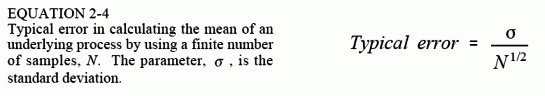
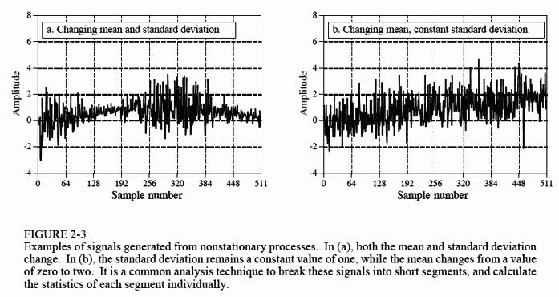

# 信号与基本过程

统计学是解释数字数据（例如采样信号）的科学。相比之下，在DSP中使用概率来阐述信号的生成过程。尽管它们紧密相关，但在许多DSP技术中，采样信号与基本过程之间的区别才是关键。

例如，假设我们通过抛掷硬币1000次来创建一个1000点的信号。如果硬币正面朝上，则将对应的样本的值记为1；反之记0。创建此信号的过程，其均值正好是0.5，这取决于每种可能的结果的相对概率：正面50%，反面50%。但是，实际的1000点信号的均值不太可能正好是0.5。每次生成信号时，随机过程都会使得1和0的数量略有不同。基本过程的概率是很定的，但是每次重复实验室，采样信号的统计信息都会发生变化。实际数据中发现的这种随机不规则行被称为：统计方差，统计学波动，和统计学噪声。

这带来了一些难题。当您看到“均值”和“标准差”时，如何知道作者是指实际信号的统计信息，还是生成信号的基本过程的概率？不幸的是，您只能通过上下文来理解。统计和概率中使用的术语并不是都是这样的。例如，直方图和概率密度函数（在下一节中讨论）是相互匹配的概念，这些概念被赋予了独立的名称。

现在，请回到式2-2，计算标准差。如前所述，在对方差计算其平均值时，需要将其除以N-1而不是N。为了理解为什么会这样，请设想：您正要查找某个生成信号的基本过程的平均值和标准差。为此，您需要从基本过程中采集一个包含N个样本点的信号，然后通过式2-1计算信号的平均值。然后，您可以将其当作对基本过程的平均值的估计。但是，您应当知道，统计噪声会导致错误。特别地，对于随机信号而言，N点平均值和基本过程均值之间的典型误差由下式列出：

如果N很小，那么计算平均值中的统计噪声将非常大。换句话说，您无法获得能够正确描述基本过程的足够的数据。N的值越大，误差的预期就越小。概率论中的一个里程碑，大数定律，可确保当N接近无穷大时，误差变为0。

在接下来的一步中，我们要计算所采集的信号的标准差，并将其用作基本过程的标准差的估计值。问题就发生在这里。在使用式2-2计算标准差之前，您需要已知平均值μ。但是，您并不知道基本过程的平均值，仅知道N点信号的平均值，该信号包含由于统计噪声引起的误差。误差将会使得标准差的计算值具有变小的趋势。为了补偿这一点，使用N-1来替代N。如果N很大，那么这个差异就无关紧要；如果N较小，则这个替换可以使基本过程的标准差的估算值更准确。换句话说，式2-2使对基本过程的标准差的估计。如果我们在等式中除以N，它将表示采样信号的标准偏差。

为了描绘这些想法，请查看图片2-3中的信号，并问自己：这些信号的波动是统计噪声的结果？还是基本过程的改变？也许不难说服自己，对于随机变化而言，这些变动一定与基本过程有关。以这种方式改变其特征的过程被称为非平稳过程。相比之下，先前在图2-1中展示的信号是通过平稳过程生成的，而它们的波动完全是由统计噪声引起的。图2-3b说明了非平稳信号的一个常见问题：平均值的缓慢变化会干扰标准差的计算。在此示例中，短时间内信号的标准差为1。然而，整段信号的标准差为1.16。通过将信号切割为多个短段，并分别计算每个部分的统计信息，则基本可以消除此误差。如果确有需要，可以取各段信号标准差的平均值以将其用一个数值来表示。

