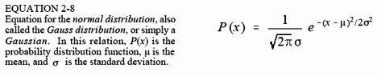
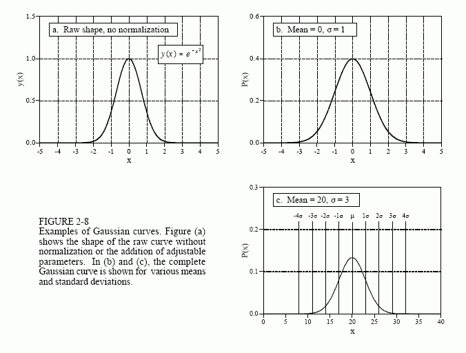
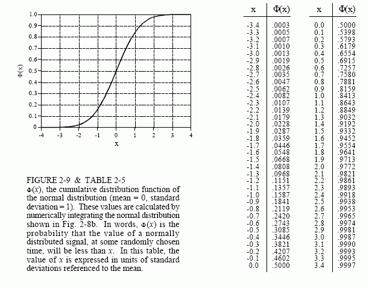

# 正态分布

由随机过程形成的信号，其pdf通常呈钟形。它由伟大的德国数学家卡尔·弗里德里希·高斯发现，并在其后称之为正态分布，或高斯分布。我们将很快讨论此曲线频繁出现的根本原因，并同时结合数字噪声的产生原理一并讨论。曲线的基本形状由负平方指数生成：

$$
y(x)= e^{-x^2}
$$

通过添加可调整的均值δ和标准差σ，可以将该曲线转换为完整的高斯曲线。此外，需对此方程进行归一化，以使曲线下方的总面积等于1，这是所有概率分布函数的基本要求。下面是正态分布的一般形式，这是统计和概率中最重要的关系之一：

图2-8显示了具有各种均值和标准差的几个高斯曲线示例。平均值使曲线在特定值上居中，而标准差则控制钟形的宽度。

高斯曲线一个有趣的特征是，曲线两端会迅速向零下降，比其他常用函数（例如指数衰减或1/x）快得多。例如，如果偏离平均值两个、四个和六个标准差的距离，高斯曲线的值将下降到大约1/19、1/7563和1/166,666,666。这就是图2-6c的正态分布信号的峰峰值基本近似的原因。原则上来说，该类型的信号振幅可以是无穷大。但在实际中，高斯pdf的急剧下降表明这些极端情况几乎不会发生。这导致表观峰峰值的波形具有相对有界的外观，宽度大约为6-8σ。

如先前所示，pdf的积分用于表示信号在某个值范围内的概率。这使得pdf的积分非常重要，足以给它取一个新名字，累积分布函数\(cumulative distribution function, cdf\)。高斯函数的一个特别令人讨厌的问题是，不能使用普通方法对齐进行积分。为了解决这个问题，可以通过数值积分的方式来计算高斯函数的积分。这涉及对连续的高斯曲线进行非常精细的采样，例如在-10σ到+10σ之间取几百万个点。然后对离散信号中的样本值求和以模拟积分。最后，将这种模拟积分产生的离散曲线存储在表格中，用于计算概率。

正态分布的cdf如图2-9所示，其数值在表2-5中列出。由于此曲线的使用概率很高，因此为其指定了新的符号Φ\(x\)（大写希腊字母Phi）。例如，Φ\(-2\)的值为0.0228。这表明在任何随机时刻，信号在-∞和低于平均值两个标准差之间的概率为2.28%。同样地，Φ\(1\)=0.8413，表明在任意时刻，信号值在-∞到高于平均值两个标准差之间的概率为84.13%。要计算信号在两个值之间的概率，就要在Φ\(x\)中取两个适当的数字并相减。例如，在任意时刻，信号在均值下方两个标准差和均值上方一个标准差之间的概率，由该式得出：Φ\(1\) - Φ\(-2\) = 0.8185，或者说81.85%。

使用这种方法，对一个正态分布的信号进行采样，得到的信号其值处于均值上下1σ之间的时间占比大约为68%。处于±2σ之间的时间占比为95%，处于±3σ之间的时间占比为99.75%。信号与均值之间的偏差超过10σ的可能性非常小，小到它仅占自宇宙诞生（140亿年）以来的几个微秒。

式2-8也可以用于表示正态分布离散信号的概率质量函数。在这种情况下，x被限制为信号值域范围内的某一量化电平，例如12位模数转换器4096个二进制数字中的一种。忽略掉1/√2πσ项，它仅用于使pdf曲线下方的总面积等于1。相反，您必须包括使pmf中所有值的和等于1所需得所有项。在大多数情况下，这是通过不考虑归一化地生成曲线，将所有未归一化的值相加，然后将所有值除以总和来完成的。

