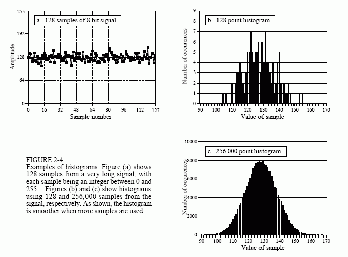
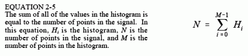
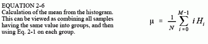
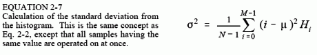
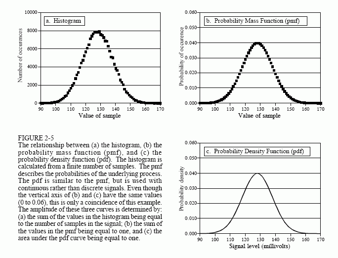
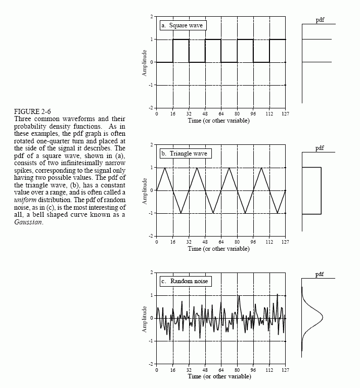
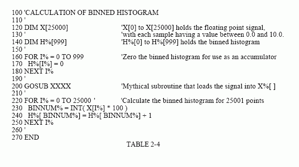
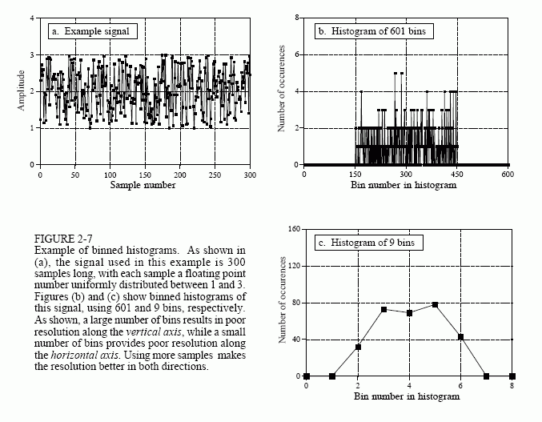

# 直方图，Pmf和Pdf

假设我们将一个8位的模数转换器连接到计算机上，并用它来采集并生成一个样本点数量为256,000点的信号。例如，图2-4a显示了128个样本，它们可能是该数据集的一部分。每个样本点的取值范围是0-255。直方图显示的是，信号中可能取某值的样本点数量。图b是图a中128个样本的直方图。

例如，有两个样本的值是110，8个样本的值是131，0个样本的值是170，等等。我们用Hi表示直方图，其中i的取值范围是0到M-1，M是每个样本点的可能值的数量。例如，H50表示对于每个样本点可以有50种不同的取值。图c显示了使用完整数据集的所有的256,000点的信号直方图。可以看出，样本数量变大将使得直方图外观更加平滑。如同平均值一样，直方图的统计噪声（粗糙度）与所用样本数的平方根成反比。

从定义来看，直方图中所有值的总和必须等于信号中的点数：

直方图可以十分有效地计算非常大的数据集地平均值和标准差。这对于可能包含数百万个样本点地图像来说尤其重要。直方图将具有相同值地样本点划分到一组。这将可以使计算机同时对多组数据进行处理来计算统计数据，而不是使用庞大的单组数据来进行。 可以使用以下公式来根据直方图计算平均值和标准差：

表2-3包含了使用这些公式计算直方图、均值和标准差的程序。直方图的计算非常快，因为它只需要索引和递增。相比之下，计算均值和标准差则需要进行耗时的加法和乘法运算。该算法的策略是仅对直方图中的几个数字进行这些慢速操作，而不是对大量样本。这使得该算法的速率较先前描述的快很多。对于很长的信号，在普通计算机上执行该计算时，请考虑将系数设置为10。

获取的信号是基础过程的嘈杂版本，这一概念非常重要；重要到以致于某些概念被赋予了不同的名字。直方图是由采样信号形成的。基础过程的响应曲线被称为概率质量函数（pmf）。直方图总是使用有限数量的样本来计算，而pmf是从无限数量的样本中计算所得的。pmf可以从直方图中直接估计而来（推断），也可以通过某些数学技巧来推导得出，例如在抛掷硬币这个例子中。

图2-5展示pmf的示例，以及一个可能与之相关的直方图。理解这些概念的关键在于垂直轴的单位。如前所述，直方图的垂直轴是信号中出现特定值的次数。pmf的纵轴包含了类似的信息，但以小数表示。换句话说，将直方图中的每个值都除以样本总数，即可近似得到pmf。这意味着pmf中的每个值都必须介于0和1之间，并且pmf中所有值得总和将等于1。

Pmf很重要，因为它描述了基本过程生成某个值的可能性。例如，想象以下由图2-5b所描述的过程生成的信号，形如在2-4a中所展示的样式。从该信号中抽取一样本点，其值为120的概率是多少？图2-5b给出了答案，0.03或1/34。随机抽取的样本其值大于150的概率是多少？将pmf中的值相加：151、153、153……255，得出的答案为0.0122或1/84。因此，平均而言，每82个样本中就有一个样本其值大于150。任取一点其值在0-255之间的概率是多少？将直方图中的所有值相加，得到其概率为1.00，这肯定会发生。

直方图和pmf只能用于离散信号，例如储存运行在计算机中的数字信号。类似的概念同样适用于连续信号，例如模拟电子设备中出现的电压。与概率质量函数适用于离散信号相比，概率密度函数（pdf），也称为概率分布函数，则适用于连续信号。例如，假设有一个模拟信号，经过模数转换器，产生了图2-4a所示的数字信号。为简单起见，我们假定0-255mv的电压都被数字化为0-255之间的数字。该数字信号的pmf由图2-5b显示。相似的，模拟信号的pdf由c图中的实线表示，代表信号可以是连续范围内的任意值，例如电子电路中的电压。

Pdf的纵轴表示的是概率密度，而不仅仅是概率。例如，在120.5处的pdf为0.03并不意味着120.5mv的电压将在3%内的时间段上出现。实际上，连续信号的值恰好为120.5mv的可能性极小。这是因为信号需要用无限多个可能的时间在120.49997、120.49998、120.49999之间进行微调。信号恰好是120.0000的可能性确实很小！

为了计算概率，需要将概率密度乘以区间长度。例如，信号在任意给定时刻，值在120-121之间的概率为：（121-120）x0.03 = 0.03。信号在120.4和120.5之间的概率为：（120.5-120.4）x0.03 = 0.003，以此类推。如果pdf在目标范围内不是一个恒定的值，则乘法将变成该范围内的pdf的积分。换句话说，是一个以特定值为边界的，pdf曲线下方的面积值。由于信号的值必须始终为某一确定值，因此pdf曲线下方的总面积（从-∞到+∞）将始终等于1。这类似于：所有pmf的值的总和等于1、直方图上所有值的总和等于N。

直方图、pmf和pdf是非常相似的概念。数学家总是直接使用他们，但你会发现他们经常被许多和科学家们和工程师们互换使用（因此错误地使用了他们的概念）。图2-6显示了三个连续波形及其pdf。如果这些信号是离散信号（将横轴标签改为“样本编号”），则将使用pmf。

当每个样本可以呈现的电平种类数远大于信号中的样本数量时，在计算直方图时会出现问题。对于用浮点表示法表示的信号（浮点信号中每个样本都被存储为小数形式）来说尤其如此。例如，整数表述可以将样本值记为3或4，而浮点表述则允许使用数百万个介于3和4之间的小数。先前描述的用于计算直方图的方法需要计算所有样本点的数量，这些样本点的取值可能为量化水平可取范围内的任意值。对于浮点数据来说，这是不可能的，因为必须考虑数十亿个可能的水平。更糟糕的是，几乎所有的量化水平都没有与之对应的样本。例如，假设一个10,000点信号，每个样本点具有十亿个可能值。传统的直方图将由十亿个数据点组成，除去大约10,000个数据点之外，其他所有数据点的值为0。

解决此问题的方法时使用一种叫做分箱（binning）的技术。这是通过将直方图的长度选为任意方便的数字来实现的例如1000个点，通常称为1000组。每个箱（bing）的值表示信号在一定范围内的样本总数。例如，假设有一个浮点信号，值域为0.0-10.0，另有一个1000箱的直方图。直方图中的箱0是信号取值为0-0.01的样本数量，箱1是信号取值为0.01-0.02的样本数量，以此类推，至箱999包含的是信号取值为9.99-10.0的样本数量。表2-4给出了一个以这种方式计算分箱合并后的直方图的程序。

应该设置多少个箱？这是一个在两个困境之间的妥协。如图2-7所示，过多的分享使得我们难以估计基础pmf的幅值，这是因为各个箱中仅有寥寥几个样本，因此它的统计噪声非常高。在另一个极端里，分箱数量太少使得我们难以估计水平方向的基本pmf。换句话说，量我们需要在权衡y轴的分辨率和x轴分辨率之后，再设置分箱的数量。

